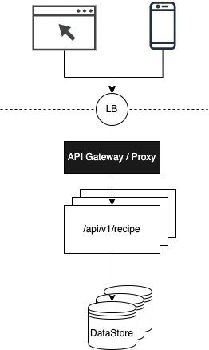

# Recipe Book Web-App

Example project implementing an API that allows to create/view/manage your recipes!

## Description documentation

### Requirements

1. REST application to manage (CRUD) recipe objects
2. Persistence of recipe information
3. Production ready (testing, API documentation, standard packaging/Docker image, deployment descriptors, security-layer)

### High-level design



Decisions & assumptions:

1. Stateless service implementation, containerized and horizontally scalable across AZs & regions
2. Persistent data-store capable of handling high-volume read operations
    1. Opted for a NoSQL database (DynamoDB). The main reason for this choice is that the recipe entity data sits in a single table, the ingredients list is also made up of objets that are _"unique-enough"_ per recipe due to name-amount combination. With this in mind a schema-less data-store meets the requirements and is flexible for future extensions to the data-model.
3. Data model
   ````
   {
     "id": "1000001",
     "created": "12-05-2022 10:47",
     "type": "VEGETARIAN",          // | VEGAN | CARNIVORE
     "servings": 4,
     "duration": "90",
     "ingredients": [
       {"name": "flour", "amount": 200, "unit": "gram"},
       {"name": "salt", "amount": 7, "unit": "gram"},
       {"name": "dry yeast", "amount": 10, "unit": "gram"},
       {"name": "tomatto sauce", "amount": 250, "unit": "gram"},
       {"name": "mozzarella", "amount": 200, "unit": "gram"},
       {"name": "olive oil", "amount": 20, "unit": "gram"},
     ],
     "instructions": "prepare dough, preheat oven, bake, serve"
   }
   ````
   Although _Ingredient_ is a distinct object with defined attributes, the list of ingredients for a recipe is not persisted in another table.  
   The reasons being:
   1. They belong together from perspective of querying (updating, removing etc) a recipe.
   2. Queries where individual and/or all ingredients are important to know (for all or related recipes) are mainly for analytics (ie how many ingredients are used in all recipes, how many recipes use ingredient X etc).  And even for functionality depending on aggregating ingredients, it's possible to query the recipe-table and expand the ingredients column before aggregation occurs.
   3. Data normalized this way would not benefit from storage savings, the amounts & units are close to unique per recipe. 

4. Container image for the application is created during application build (separate profile that can be enabled). Since the service is stateless it can be easily scaled as long as the data-store is scaled with it to support all connections from all service instances.
5. Security layer currently implemented at the service side using Spring-Security.
   1. However it is a good practice to push some of these concerns out of the service implementation and into an upstream layer such as API Gateway or a side-car proxy, components that are more capable of handling authentication, authorization and throttling/quota for incoming requests, thus limiting the amount of traffic that gets to be handled by the service.

### Deployment

1. Local / development deployment using docker-compose allows for quickly running the application and dependencies.
    ````
    # start containers
    docker-compose up
    Creating network "recipes_default" with the default driver
    Creating dynamodb ... done
    Creating recipes_recipe_service_1 ... done
    Attaching to dynamodb, recipes_recipe_service_1
    dynamodb          | Initializing DynamoDB Local with the following configuration:
    dynamodb          | Port:	8000
    ...
    recipe_service_1  | 2022-05-15 15:37:46.242  INFO 1 --- [           main] org.example.recipes.RecipesApplication   : Starting RecipesApplication v0.1.0-SNAPSHOT using Java 17.0.2 on 3ce39535b0a7 with PID 1 (/home/appuser/recipes-0.1.0-SNAPSHOT-sb.jar started by appuser in /home/appuser)
    recipe_service_1  | 2022-05-15 15:37:48.883  INFO 1 --- [           main] org.example.recipes.RecipesApplication   : Started RecipesApplication in 2.974 seconds (JVM running for 3.392)

    # (SKIP, sample DB commited to repo!)
    # initialize DB (only required once, data is persisted on disk between runs at: ./docker/dynamodb/*.db)
    mvn clean test -Dtest=org.example.recipes.test.integration.DatabaseInit
    ````

### Security

1. Endpoints protection, authentication (user or client based) & authorization
   1. TODO: Request throttling to protect against malicious or compromised clients
   2. TODO: Client authentication (API key?, cryptographically signed tokens?)

### Next steps:

1. Scaling
2. Security
   1. Authorization - which API is the client allowed to call & with what parameters, ie creating-recipes should require editor-access
   2. Application scanning (dependencies / BOM)
      1. Scanning code for bugs
      2. Scanning dependencies for known vulnerabilities in used versions
      3. Scanning container-images for known OS vulnerabilities, elevated application rights etc
      4. Scanning container-platform/application at runtime for:
          1. Permissions assigned to application in its sandbox, ie can it access more than required services such as the DB.
          2. Scanning HTTP traffic coming to/out of the application ie via ingress/egress gateway, making sure it is not going to known addresses.
3. Backups
4. Monitoring & logs
5. Analytics

## Use documentation

### Prerequisites

- Java 11+
- Maven 3.8+
- Docker engine

### Build

````
mvn clean install -Pdocker
````
> Profile _docker_ during build is optional.

### Run

````
docker-compose up
````

Access: [/api-docs](http://localhost:8080/api-docs) or [/swagger-ui](http://localhost:8080/swagger-ui/index.html) endpoints for documentation.

### Test

````
mvn clean test -Dtest=org.example.recipes.test.integration.RecipeControllerTest

...
recipe_service_1  | 2022-05-15 15:21:13.406  INFO 1 --- [           main] org.example.recipes.RecipesApplication   : Started RecipesApplication in 3.089 seconds (JVM running for 3.467)
recipe_service_1  | 2022-05-15 15:24:07.021  INFO 1 --- [nio-8080-exec-2] o.e.recipes.controller.RecipeController  : Created recipe with id: a12cb443-6b42-44f4-b975-c24511421ac2
recipe_service_1  | 2022-05-15 15:24:07.190  INFO 1 --- [nio-8080-exec-4] o.e.recipes.controller.RecipeController  : Updated recipe with id: a12cb443-6b42-44f4-b975-c24511421ac2
recipe_service_1  | 2022-05-15 15:24:07.342  INFO 1 --- [nio-8080-exec-5] o.e.recipes.controller.RecipeController  : Removed recipe with id: a12cb443-6b42-44f4-b975-c24511421ac2
````

## References

- DB/PostgreSQL: https://hub.docker.com/_/postgres/
- DB/DynamoDB: https://docs.aws.amazon.com/amazondynamodb/latest/developerguide/DynamoDBLocal.DownloadingAndRunning.html
